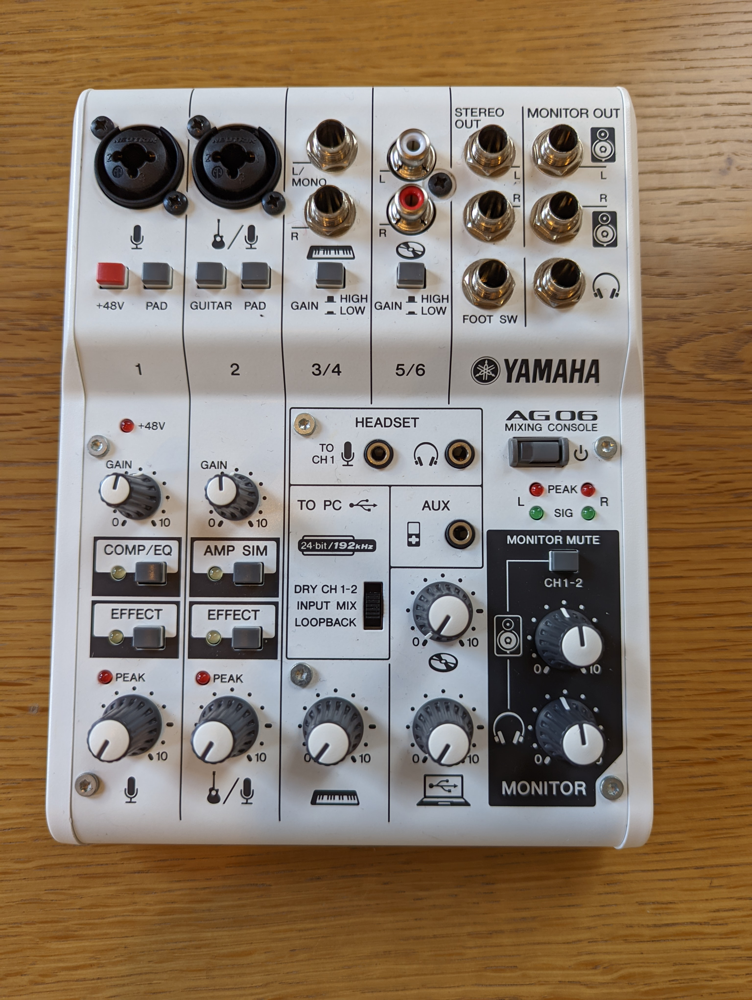
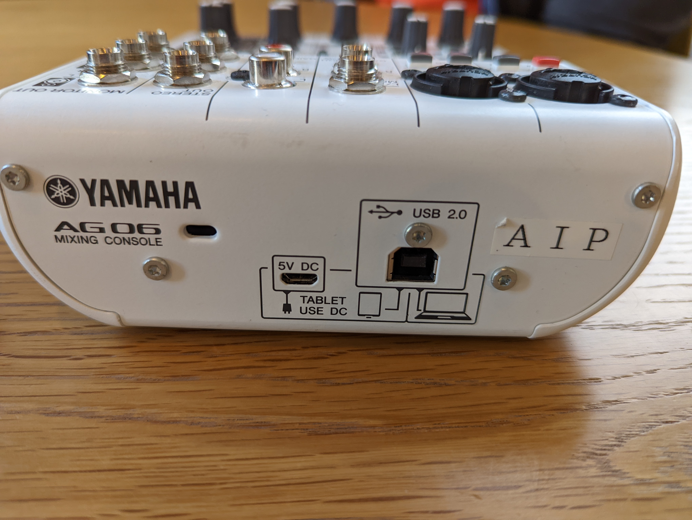
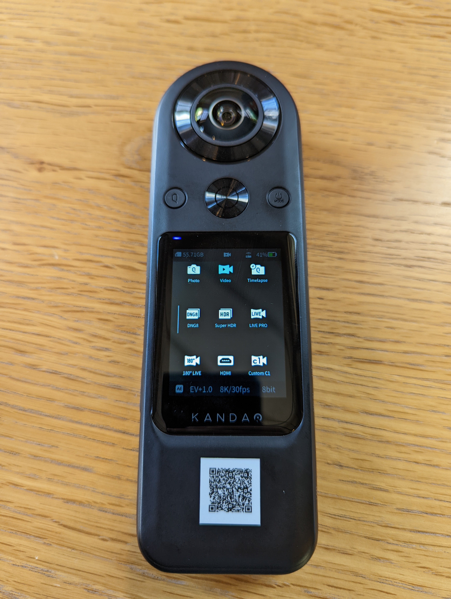
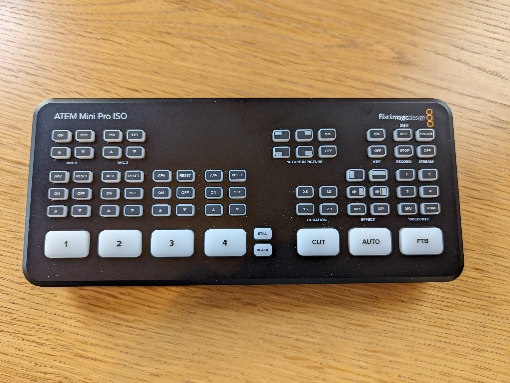
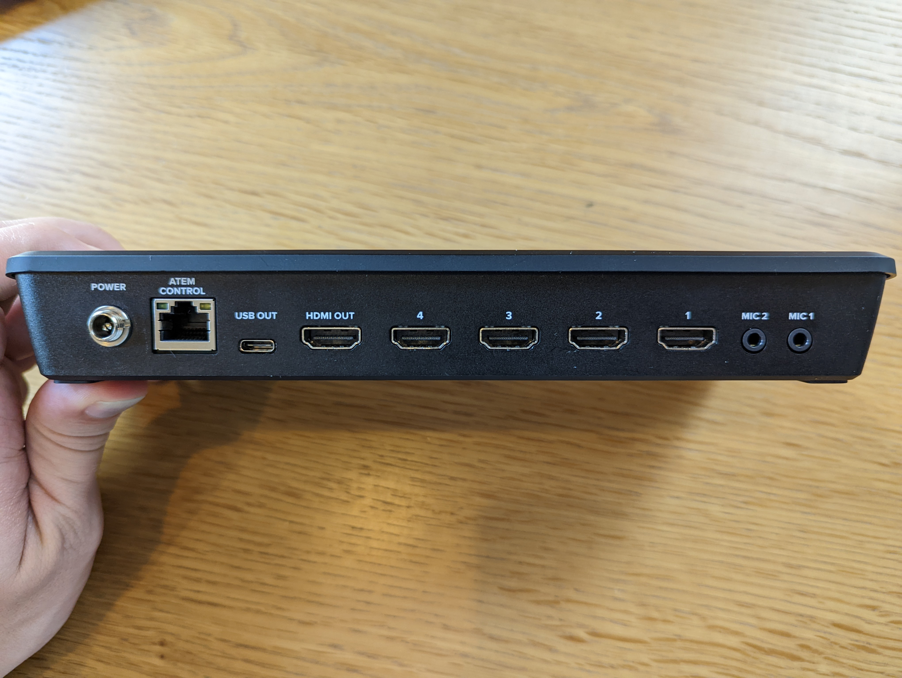

# Event and Stream Setups
# イベントや配信のセットアップ

## Sound / Podcast Setup
1. Plug USB cable from AG06 to computer or iPad (you may need additional power). Switch on. 
2. Plug in microphone via XLR or 1/4 inch. (+48v is NOT pressed in)
3. Plug in headphones for monitoring (to hear your audio as you record). Set the monitor level to around 5. This volume is just for the headphones and doesn't affect the main audio output. 
4. Speak into the microphone and adjust the gain. Gain is the input level and is different for different microphones. (Engineer Cafe wired mics need about 7-8 and wireless mics a little less).
5. Adjust the level so you can hear yourself well.  If the red light flashes you are peaking. This is too loud.  You should turn the level down so the right light never flashes.
6. Set the level and gain for the the second microphone. 
7. The AG06 will output via USB to a computer or iPad, or by stereo 1/4 inch output to a recorder or streaming device. 

## 音声・ポッドキャスト
1. USBケーブルでAG06とパソコン（またはタブレット）を接続する。パワーボタンをオンにする。
2. XLR端子や1/4インチ端子にマイクを接続する。(+48Vを押してないことを確認する)
3. モニター（モニター＝音の確認）のためヘッドフォンをMONITOR OUTに繋ぐ。モニターの音量を５に設定する。モニターのボリュームを変えても出力音量は変わらない。
4. 本番と同じような位置でマイクに話してGAINを設定する。エンジニアカフェの有線マイクは7-8ぐらいで使える。
5. 自分の声が聞こえるようにマイクのレベルを設定する。赤いLEDが光ったらpeakになっている。音が大きすぎるときれいに取れない。絶対peakにならないようにマイクのレベルを下げよう。
6. 各マイクに4-5を繰り返す。
7. AG06ミキサーはUSB、または1/4インチ端子で出力できる。

## 360 Camera Stream 
1. The 360 camera can stream straight to YouTube via Wifi or ethernet. 
2. Turn on with the power button.
3. Set to "live pro" mode.
4. Press the large button to start streaming data to Youtube. 
5. The internal audio is unusable.  You must connect an external audio source (for example, AG06 or main hall soundboard) 
6. The stream key is linked to the Engineer Cafe YouTube account. Talk to your Community Manager if you want to use a different stream key.  

## 360度カメラ配信
1. 360度カメラはWiFiと有線LANで直接にyoutubeに配信できる。
2. 電源をオンにする
3. モードをLive Proに設定する。
4. 真ん中の大きいボタンを押すとデータ配信がスタート。(Youtube側でまた配信スタートしないと生配信が始まらない)
5. 内蔵マイクは使用に適さない。外部マイクやミキサーを接続しないといけない（AG06など）。
6. YouTubeの配信キーはエンジニアカフェのに設定されている。違うキーを使いたい場合コミュニティーマネジャーに相談してください。

## Wireless Microphones
1. Long press to turn on, units should pair automatically. 
2. If they don't pair, press the button on both parts at the same time.

## 無線マイク
1. 長押ししてオンにする。自動でペアリングする。
2. ペアリングできない場合同時に受信機と発信器のボタンを押すとペアリングできる。

## Room sound / Local sound only (no stream)
1. The main hall soundboard usually runs the background music from an Apple TV over bluetooth. Turn this down if you don't need background music. 
2. Plug in wired or wireless microphones into free XLR inputs.  
3. Turn up the sound SLOWLY while speaking.
4. Handheld wireless mics are already plugged in.  Turn up the levels to use them.
5. Audio from projector HDMI is is often unplugged.  Plug in with the red and white cables from the projector.

## メインホールのスピーカー(配信なし)
1. メインホールのミキサーは普段bgmがAppleTVからブルートゥースで流されている。BGMが必要でない場合これをゼロにしてください。
2. 空いているXLR端子にマイクを接続する。
3. ゆっくりLEVEL (白いダイヤル)をあげる。
4. 手持ち無線マイクは常に接続されている。使う場合LEVELを調整する。
5. プロジェクターの音声は赤と白のケーブルで入る。外されている場合も多いので確認してください。

## ATEM Mini (Video switcher/streamer)
1. The ATEM outputs "program" to USB-C and ethernet (stream to YouTube). HDMI can show the same "program" or can show a preview of other things. 
2. PGM means HDMI is exactly the same as the stream ("program").  M/V gives you a preview of all inputs and the output.  1, 2, 3, 4 gives you a preview of the individual inputs (but doesn't change the stream). 
3. For example, plug in a camera to HDMI-1 and the presenter's computer to HDMI-2.  Set preview to 2, and plug projector into the HDMI output. The projector will always show the slides.  Then use the big number buttons to switch between camera and slides. 
4. Audio can come from the AG06, the main hall mixer or somewhere else. Audio also comes from the 4 HDMI inputs 
5. Audio is output over HDMI, USB-C and network stream. 
6. Audio can be on, off or AFV (audio follow video) for each HDMI1-4.  AFV means you only hear the audio when looking at the video from that camera.  
7. Mic 1 and Mic 2 can be turned on and off separately.  
8. Press "On air" to send video data to YouTube (the streaming key is setup for the Engineer Cafe Youtube Account).

## ATEM Mini (映像スイッチャー・配信)

1. ATEMminiはPROGRAMをUSBーCと有線LANに出力する。HDMIはPROGRAMと同じ映像またはその他の映像を出力することができる。
2. PGM(PROGRAM)ボタンを押すとHDMIと配信が同じになる。M/Vボタンでカメラと出力映像のプレビューが見られる。1,2,3,4はそれぞれ各カメラのプレビューだ（配信している画像には影響を与えない）。
3. 例えば、HDMI-1にカメラ、HDMI-2にプレゼンターのパソコン、HDMI-OUTにプロジェクターをつなぐ。2を押すとプロジェクターはパソコンの画面を表示する。大きなボタンでスイッチングする。
4. AG06やメーンホールのミキサーから入れることができる。
5. 音声出力は有線LAN、USB-CまたはHDMI。
6. 音声設定はON,OFF,AFV(映像と一緒にスイッチ)。AFVに設定されたらHDMI1を押したらそのカメラの音声も流れる。 
7. Mic 1とMic 2は各設定でONとOFFになる。
8. ON AIRを押すとYouTubeにデータを送り始める。(配信キーはエンジニアカフェのに設定されている)

## Stream with audio guest/audio questions from Zoom
1. Enter the Zoom meeting with a computer for zoom (not presenter's computer).
2. Plug AG06 into the Zoom Computer. In the Zoom settings, set mic and speaker to AG06.
3a. (If only using guest speaker sound) Plug the Atem Mini USB-C into the Zoom Computer. Set Zoom to use it as webcam. (This is a good option for audience questions where you are not using webcam feeds from the audience.
3b. (If using guest sound and video). Plug an HDMI cable from the Zoom computer into the AtemMini switcher. Plug a USB webcam into the Zoom computer. Set Zoom to use this as a webcam. (This allows the speaker to see the room while they speak)
4. The Zoom guest's audio comes out of the Zoom Computer by USB into the AG06.  The dial with the laptop symbol controls the level. 
5. The AG06 line out goes into the main hall mixer so everything can be heard from the speakers (Use 1/4 inch mono cables).
6. The AG06 monitor out goes into the Atem Mini so the stream has all the Audio.  (Don't forget to check the level on the Atem Mini preview to avoid peaking)
7. (Zoom does not get its own audio sent back to it, and people in the main hall can hear both local and remote speakers clearly.)

## Zoomのリモート登壇者の配信

1. Zoom用パソコンでZoomに入る
2. Zoom用パソコンとAG06を接続する。Zoomの設定でマイクとスピーカーをAG06にする。
3. A (リモート登壇者は音声だけの場合)AtemMiniをUSB-CでZoom用パソコンに接続。Zoomの設定でカメラをAtemMiniにする。(Zoom参加者が顔出さないことは多い)
3. B (リモート登壇者は画像と音声の場合)ZoomのパソコンとAtemMiniをHDMIで接続。USBウェブカメラなどを使ってZoomの登壇者に会場を見せる。
4. Zoomの音声はUSBで出力し、AG06に入る。ノートパソコンのダイヤルでレベル調整。
5. AG06のLINE-OUTをメインホールのミキサーとつないでメインホールのスピーカーで聞こえる。
6. AG06のMONITOR-OUTをAtemMiniに入れる。(PEAKに気をつけて)
7. (Zoomは自分の音声なしで会場の音声聞こえる)

## Ethernet Cables
1. Located behind the main hall soundboard and behind the bookshelf.
2. Connects up to "ECEvent" wifi

## 有線LAN

1. 二つの箇所にある。メインホールのミキサーと書籍棚の裏
2. ECEventと同じWifi

